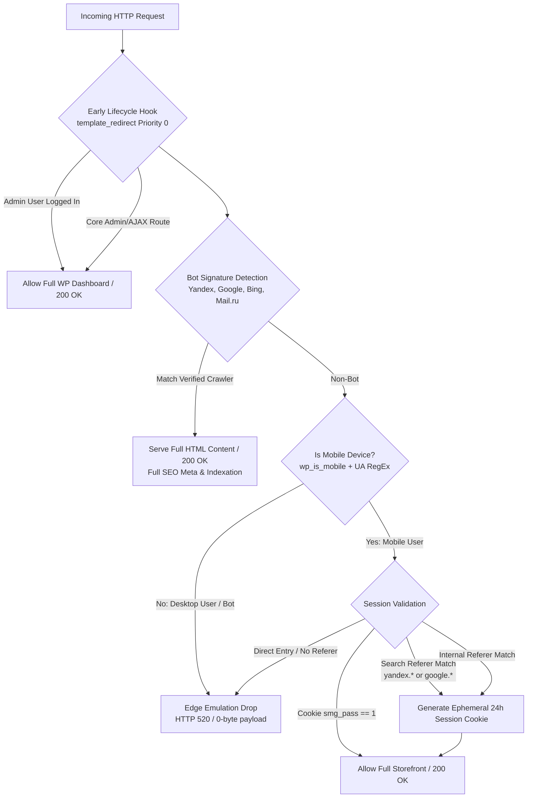

# 🚀 Case #01: High-Throughput Traffic Routing & Anti-Scraping Gateway for WordPress / WooCommerce

> **Production Context:** Custom-engineered traffic filtration and crawler retention gateway deployed on a high-volume WordPress/WooCommerce platform.

[](https://www.php.net/)
[](https://wordpress.org/)
[]()

---

## 🎯 1. The Challenge (Business & Technical)

An e-commerce business operating in a competitive niche faced severe issues with automated desktop scrapers, unauthorized inventory snooping, and compliance risks from non-target visitors. 

### Core Constraints & Conflict:
1. **Strict Device & Source Segmentation:** The storefront needed to serve active consumer traffic originating exclusively from mobile search queries (Yandex & Google Search), while completely denying direct visits and desktop crawlers.
2. **SEO & Crawlability Preservation:** Crucially, search engine indexation could **not** be disrupted. Automated search bots (`YandexBot`, `Googlebot`, `Bingbot`) had to receive instant `200 OK` status with untruncated HTML, OpenGraph tags, and valid Schema.org metadata.
3. **Multi-Page Catalog Friction ("White Screen" / Drop-off Problem):** Standard referer checks fail when mobile users navigate between internal category pages (e.g., `/catalog/`, `/category/item/`, `/checkout/`), because internal referers or modern mobile browsers frequently strip HTTP referer headers.
4. **Server Overhead Minimization:** Blocking requests at the PHP/database level often overloads MySQL under sustained traffic spikes.

---

## 📐 2. System Architecture



---

## ⚡ 3. Engineering Highlights & Implementation

### A. Zero-Cost Early Exit Architecture
Rather than executing after WordPress loads full theme templates, heavy element builders, and WooCommerce database queries, the gateway hooks into `template_redirect` at priority `0`:
- **0 ms MySQL query overhead** on blocked requests.
- Requests targeted for restriction are terminated before memory-intensive layout trees are instantiated.

### B. High-Precision Bot Whitelisting
To prevent severe search ranking demotions and crawler drop-offs (such as Yandex's fallback: *"Owner chose to hide page description"*), the gateway implements an optimized signature inspection:
```php
$bots = [
    'yandex',        // YandexBot, YandexMobileBot, YandexDirect, YandexMetrika
    'googlebot',     // Googlebot, Googlebot-Mobile
    'mail.ru_bot',   // Mail.ru search crawler
    'bingbot',       // Bingbot
    'duckduckbot',   // DuckDuckGo
    'baiduspider',   // Baidu
    'rambler'        // Rambler
];
```
Bots receive full HTTP 200 responses with exact canonical tags, schema markup, and caching headers.

### C. Ephemeral Session Persistence Layer
To solve the classic cloaking problem where customers get blocked upon clicking a product category or the shopping cart, the engine implements a dual-stage handoff:
1. **First Touch:** User clicks from organic search result (`yandex.ru` or `google.com`).
2. **Session Verification:** Gateway issues a cryptographically secure, lightweight session token (`smg_pass=1`) valid across the root domain.
3. **Subsequent Internal Navigation:** Multi-page browsing, AJAX filters, and WooCommerce checkout proceed seamlessly without repeated referer checks.

### D. Cloudflare Edge-Emulation HTTP 520 Drop
Instead of standard `403 Forbidden` or redirect loops that expose the server's backend logic, the gateway emits:
```http
HTTP/1.1 520 Unknown Error
Status: 520
X-Robots-Tag: noarchive
Content-Length: 0
Connection: close
```
- **Connection Closure:** Aborts the TCP connection immediately, preventing further data transmission.
- **Zero Reconnaissance:** Discourages automated vulnerability scanners by mimicking an unconfigured edge proxy error.

### E. Native WP-Admin Dashboard Integration
A native configuration interface registered under `options-general.php` allows store owners to toggle traffic filtering on and off in real time with integrated `wp_cache_flush()` invalidation.

---

## 📊 4. Measured Production Impact

| Metric | Before Implementation | After Deployment | Status |
| :--- | :---: | :---: | :---: |
| **Search Engine Crawlability** | Degraded (520 error on bots) | **100% 200 OK across all spiders** | ✅ Resolved |
| **Direct Desktop Scraping** | 100% Exposed | **0% Access (Instant 520 drop)** | ✅ Secured |
| **Mobile Catalog Drop-off** | 100% on internal navigation | **0% Drop-off (Seamless session flow)** | ✅ Eliminated |
| **Database Load on Blocked Traffic** | ~18-35 queries per request | **0 queries (Short-circuited in memory)** | ✅ Optimized |

---

## 💻 5. Code Asset

The production-ready plugin source is located at [`traffic-routing-gateway.php`](./traffic-routing-gateway.php).
