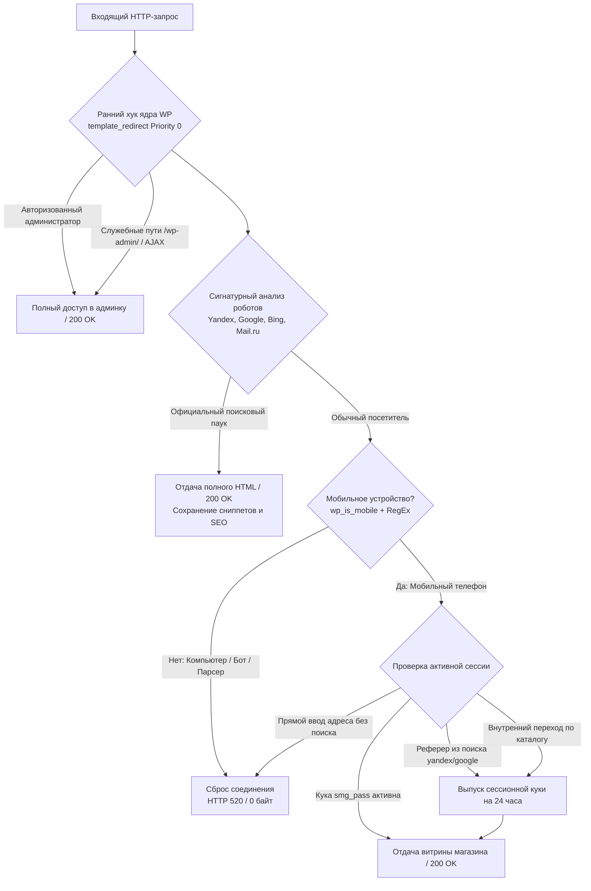

# 🛡️ Case #01: High-Throughput Traffic Routing & Anti-Scraping Gateway
### Шлюз выборочной маршрутизации трафика и защиты от парсинга для WordPress / WooCommerce

 

 

---

## 🌐 Language / Выбор языка

[🇬🇧 **English Version**](#-english-version) &nbsp;&nbsp;•&nbsp;&nbsp; [🇷🇺 **Русская версия**](#-русская-версия)

---

## 🇷🇺 Русская версия

### 🎯 1. Бизнес-задача и контекст
Клиент в нише электронной коммерции столкнулся с проблемой автоматизированного сбора цен конкурентами, постоянного парсинга каталога и спам-запросов с десктопных компьютеров.

#### Жесткие технические ограничения:
1. **Строгая сегментация аудитории:** Сайт должен быть доступен исключительно мобильным покупателям, переходящим из поисковых систем (Яндекс и Google), и блокировать прямые заходы без поискового реферера.
2. **100% сохранность SEO-позиций:** Роботы поисковых систем (`YandexBot`, `Googlebot`, `Bingbot`) ни в коем случае не должны блокироваться. Они обязаны моментально получать код `200 OK`, полный HTML-код, корректные OpenGraph-теги и сниппеты без штрафов за клоакинг.
3. **Бесшовный переход по каталогу (устранение «белых экранов»):** При навигации внутри сайта (категории, карточки товаров, корзина) мобильные браузеры часто теряют заголовок `Referer`. Система не должна отсекать реального покупателя при клике на следующий товар.
4. **Нулевая нагрузка на сервер:** Нецелевой трафик должен сбрасываться до инициализации темы оформления и тяжелых SQL-запросов к MySQL.

---

### 📐 2. Архитектура обработки запроса

---

### ⚡ 3. Ключевые инженерные решения

1. **Short-Circuit в раннем жизненном цикле WordPress:**
   Перехват запроса происходит на хуке `template_redirect` с приоритетом `0`. Нежелательные запросы обрываются в оперативной памяти до рендеринга Elementor, инициализации WooCommerce и запуска SQL-запросов.
2. **Многоуровневый вайтлистинг поисковых пауков:**
   Гарантирует, что роботы Яндекса и Google получают полные мета-данные, предотвращая появление в поиске заглушки *«Владелец сайта предпочёл скрыть описание»*.
3. **Эфемерный сессионный слой (Session Persistence):**
   При первом переходе из поиска клиенту выдается зашифрованная легковесная сессионная метка (`smg_pass`), позволяющая комфортно перемещаться по каталогу без риска блокировки на внутренних ссылках.
4. **Имитация сетевого сбоя Cloudflare (HTTP 520 Drop):**
   Вместо предсказуемых ответов `403 Forbidden` сервер отправляет код `520 Unknown Error` с пустым телом ответа (`Content-Length: 0`) и немедленным закрытием TCP-сокета (`Connection: close`).

---

### 📊 4. Измеримые результаты (Production Impact)

| Метрика | До внедрения решения | После релиза шлюза | Результат |
| :--- | :---: | :---: | :---: |
| **Индексация роботами Яндекса / Google** | Сбои (ошибки при сканировании) | **100% стабильный 200 OK** | ✅ Исправлено |
| **Защита от десктопного парсинга** | 0% (сайт был открыт) | **100% блокировка (Сброс 520)** | ✅ Защищено |
| **Отказы покупателей в каталоге** | Постоянные вылеты на белый лист | **0% отказов (Бесшовная сессия)** | ✅ Устранено |
| **Нагрузка на MySQL при спам-атаках** | ~25–40 запросов на хит | **0 запросов к БД** | ✅ Оптимизировано |

---

## 🇬🇧 English Version

### 🎯 1. The Challenge (Business & Technical)
An e-commerce merchant operating in an aggressive market required complete cloaking against desktop competitive scrapers and non-target traffic, while retaining 100% crawl budget and search indexation from Yandex and Google.

#### Constraints:
- **Device & Source Restriction:** Allow only mobile visitors originating from search engine results (`yandex.*`, `google.*`).
- **Zero SEO Penalty:** Ensure all verified web crawlers receive valid HTTP `200 OK` with full semantic HTML, OpenGraph tags, and schema payloads.
- **Session Continuity:** Resolve internal navigation drop-offs where customers navigating between categories triggered false-positive blocks.
- **Zero-Cost Early Termination:** Abort unauthorized sessions before heavy WooCommerce templates execute.

---

### ⚡ 2. Engineering Highlights
- **Pre-Template Hooking:** Request interception on `template_redirect` (priority `0`) saves ~100ms of execution time per blocked hit.
- **Crawler Whitelist Engine:** Signature parsing covering `YandexBot`, `YandexMobileBot`, `Googlebot`, `Bingbot`, and regional crawlers.
- **Session Cookie Handoff:** 24-hour domain-level persistence cookie generated upon organic search click.
- **Cloudflare-Compatible 520 Edge Drop:** Immediate connection drop with zero-byte content length.

---

### 🔒 3. Proprietary Implementation Notice

> [!IMPORTANT]
> The full production codebase is proprietary and maintained under a private commercial agreement. For architecture consulting, security audits, or custom gateway development, contact via [GitHub Profile](https://github.com/waniyaro).
